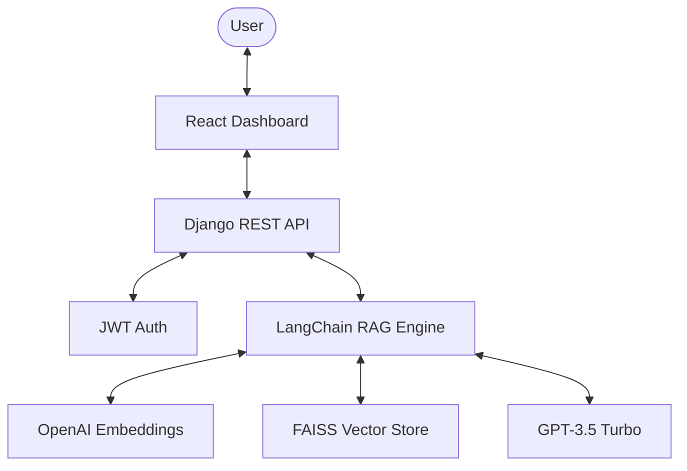

# 🚀 Rag-Bot: High-Performance RAG Assistant

A sophisticated, high-fidelity RAG (Retrieval-Augmented Generation) Assistant featuring dynamic PDF intelligence, a premium high-contrast dark UI, and lightning-fast semantic search orchestrated with FAISS, LangChain, and Django.

## 🌟 Key Highlights
- **Intelligent RAG Pipeline**: Seamlessly extract knowledge from PDF, DOCX, and TXT files.
- **Lightning-Fast Search**: Powered by FAISS for near-instant semantic retrieval.
- **Premium User Experience**: Modern, sleek dark dashboard built with React and Bootstrap.
- **Secure & Scalable**: JWT-based authentication and a structured Django/Vite architecture.

## 🏗️ Architecture Overview


## 📂 Project Structure
This repository is split into two main components:
- **[Frontend](file:///c:/Users/akank/Documents/frontend/frontend)**: The React-based user interface.
- **[Backend](file:///c:/Users/akank/Documents/rag-ai-assistant/backend)**: The Django-powered intelligence core.

## 🚀 Quick Start

### 1. Backend Setup
```bash
cd backend
python -m venv venv
source venv/bin/activate
pip install -r requirements.txt  # Ensure you have the requirements listed in backend README
python manage.py migrate
python manage.py runserver
```

### 2. Frontend Setup
```bash
cd frontend
npm install
npm start
```

## 🛠️ Tech Stack
- **Frontend**: React, Bootstrap, Axios, React Router
- **Backend**: Django, DRF, LangChain, FAISS, PyPDF2
- **AI/ML**: OpenAI GPT-3.5, OpenAI Embeddings

## 📄 Documentation
For detailed setup and technical information, please refer to:
- [Backend Documentation](file:///c:/Users/akank/Documents/rag-ai-assistant/backend/README.md)
- [Frontend Documentation](file:///c:/Users/akank/Documents/frontend/frontend/README.md)

## ⚖️ License
This project is licensed under the MIT License - see the [LICENSE](file:///c:/Users/akank/Documents/rag-ai-assistant/LICENSE) file for details.
